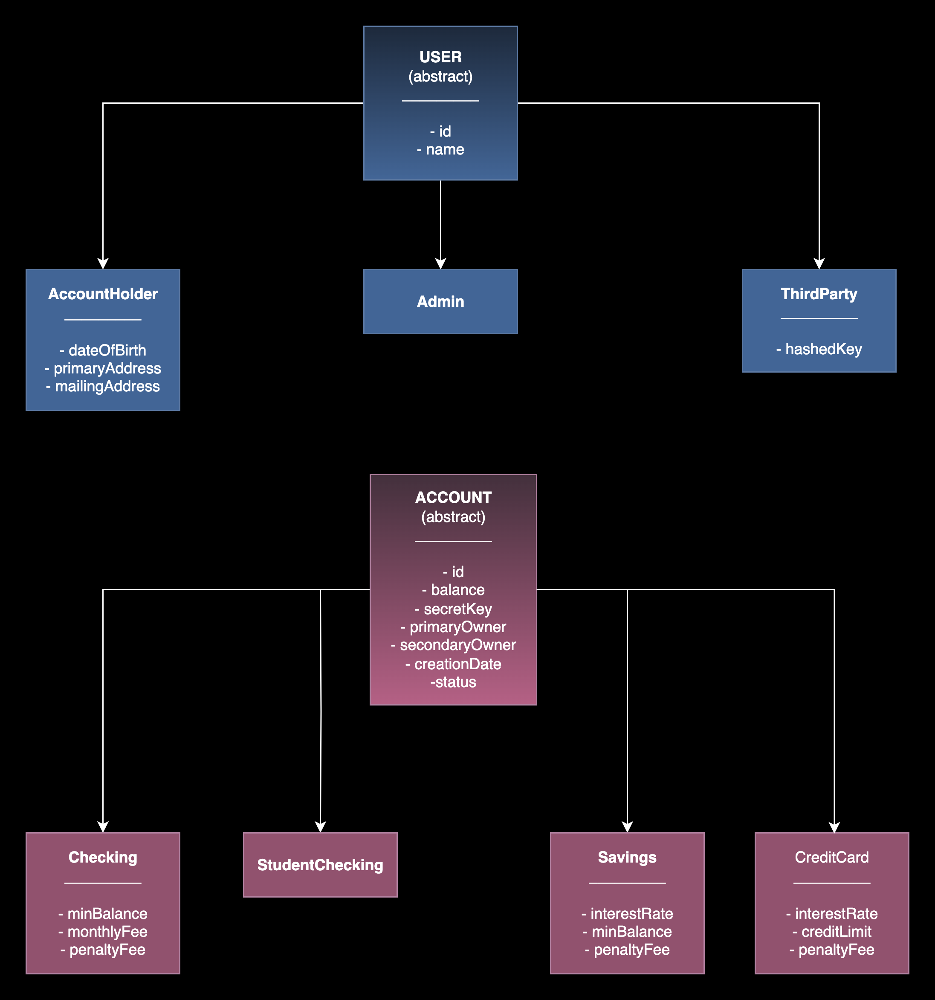

# SpringBank 💰

## Description

SpringBank is a banking system developed in Java using Spring Boot. It simulates basic bank operations such as account creation, money transfers, and balance checking. It supports multiple user roles, including Admins and Account Holders, and offers RESTful APIs for interacting with different types of accounts like Checking, Savings, and Credit Card accounts.

---

## 🧩 UML Class Diagram



The application follows a layered architecture:

- **Models:** Represent core entities like Account, CreditCard, Savings, AccountHolder, and Admin.
- **DTOs:** Used for data transfer between client and server.
- **Controllers:** Define REST endpoints.
- **Services:** Implement business logic.
- **Repositories:** Handle database operations via Spring Data JPA.

---

## ⚙️ Setup

### Requirements

- Java 17
- Maven
- MySQL Server
- Recommended IDE: IntelliJ IDEA / VS Code
- Postman
- DBeaver


## 🚀 How to run the project

1. Download the GitHub repository.

```bash
   git clone https://github.com/oneceroonedev/springbank.git
   cd springbank
```
2. Open the project with a code editor, such as `IntelliJ`.
3. Open the `SpringbankApplication.java` file and start it with **Run**. 
4. Once run, the application will be available at:

```
http://localhost:8080/
```

---

## 🧪 Technologies Used

- Java 17
- Spring Boot
- Spring Data JPA
- Spring Web
- MySQL
- Hibernate
- Maven
- Lombok
- SpringDoc + Swagger UI

---

## 📡  Endpoints

### `AdminController` - `/admin`

| Method | Endpoint                             | Description               |
|--------|--------------------------------------|---------------------------|
| POST   | `/admin/create`                      | Create an Administrator   |
| POST   | `/admin/checking-accounts`           | Create a checking account |
| POST   | `/admin/savings-accounts`            | Create a savings account  |
| POST   | `/admin/credit-cards`                | Create a credit card      |
| DELETE | `/admin/accounts/{id}`               | Delete an account by ID   |
| PATCH  | `/admin/admin/accounts/{id}/balance` | Update account balance    |

<br>

### `AccountHolderController` - `/account-holders`

| Method | Endpoint                                          | Description                |
|--------|---------------------------------------------------|----------------------------|
| POST   | `/account-holders`                                | Create a new AccountHolder |
| POST   | `/account-holders/{accountHolderId}/transfer`     | Transfer money             |
| GET    | `/account-holders/{id}/accounts?requesterId={id}` | View user accounts         |

<br>

### `AccountController` - `/accounts`

| Method | Endpoint                 | Description               |
|--------|--------------------------|---------------------------|
| GET    | `/accounts/{id}/balance` | View account balance      |

<br>

### `ThirdParty` - `/third-party`

| Method | Endpoint       | Description          |
|--------|----------------|----------------------|
| POST   | `/third-party` | Create a Third-Party |

<br>

### More endpoints
http://localhost:8080/swagger-ui/index.html

---

## 🔗 Extra Links

- [Postman Collection](https://oneceroonedev-6508060.postman.co/workspace/oneceroonedev's-Workspace~0cfb17d2-ec11-4ea9-8420-a960ba8e9eee/collection/47178195-4c37eb41-f3fa-46ce-8f18-dc3d657f6aad?action=share&source=copy-link&creator=47178195)

---

## 🚀 Future Work

- Visual dashboard (FrontEnd)
- Spring Security